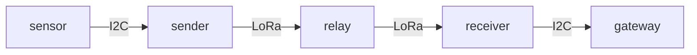

# Multihop Demonstration

This folder contains a prototype mesh lora mesh network using the LoraMesher
library and the Arduino wire library. Data is sent from a sensor node (Mayfly) 
via an I2C connection to a Lora node (Lilygo LoRa32 V2.1_1.6) which then trys
to send that data to the gateway in the mesh network. There is a relay node in
place which will relay the data if neccesary. Once the gateway node receives
the data, it transmits it via I2C to the actual gateway device which is another
Mayfly.

## Setup

Refer to the Wire library to setup the I2C connections between the LoRa boards
and the Mayflys. The pictures in the images directory illustrate the neccesary 
connections. Platformio is used to build and upload the files for each of the 
nodes and to monitor the serial output from the devices. 

Useful `pio` commands are:

```bash
pio device list
```
```bash
pio run -t upload 
```
```bash
pio device monitor 
```

## Topology



## Libraries
LoraMesher: https://github.com/LoRaMesher/LoraMesher

LoraMesher Paper: https://ieeexplore.ieee.org/stamp/stamp.jsp?tp=&arnumber=9930341&tag=1

Wire: https://www.arduino.cc/reference/en/language/functions/communication/wire/

Platformio: https://platformio.org/

## Board Information
Lora Board: https://www.lilygo.cc/products/lora3

Mayfly: https://www.envirodiy.org/mayfly/
